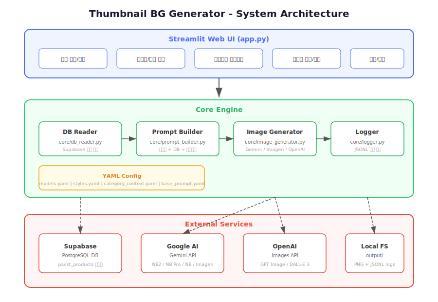
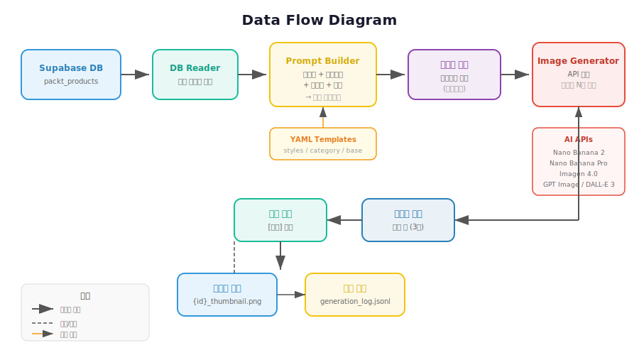
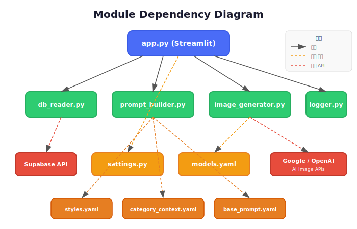

# 아키텍처 문서: 강의 썸네일 배경 이미지 자동 생성기

## 1. 시스템 아키텍처



### 레이어 구조

| 레이어 | 역할 | 구성 요소 |
|--------|------|-----------|
| **UI Layer** | 사용자 인터페이스 | Streamlit (app.py) |
| **Core Engine** | 비즈니스 로직 | db_reader, prompt_builder, image_generator, logger |
| **Config Layer** | 설정 관리 | settings.py, YAML 파일들 |
| **External Services** | 외부 API 연동 | Supabase, Google AI, OpenAI, Local FS |

## 2. 데이터 플로우



### 주요 흐름

```
1. Supabase DB → DB Reader → 강의 데이터 조회
2. 강의 데이터 + YAML 템플릿 → Prompt Builder → 최종 프롬프트
3. (선택) 사용자가 프롬프트 직접 수정
4. 최종 프롬프트 → Image Generator → AI API 호출 → 이미지 생성
5. 생성된 이미지 → UI에서 비교 → 사용자 선택
6. 선택된 이미지 → 로컬 저장 + 이력 로깅
```

## 3. 모듈 의존성



### 모듈별 책임

| 모듈 | 파일 | 책임 | 의존성 |
|------|------|------|--------|
| **DB Reader** | `core/db_reader.py` | Supabase에서 강의 데이터 읽기 전용 조회 | supabase-py |
| **Prompt Builder** | `core/prompt_builder.py` | YAML 템플릿 + 강의 데이터 → 프롬프트 조합 | PyYAML, templates/*.yaml |
| **Image Generator** | `core/image_generator.py` | AI API 호출로 이미지 생성 (Gemini/Imagen/OpenAI) | google-genai, openai, config/models.yaml |
| **Logger** | `core/logger.py` | 생성 이력 JSONL 로깅 | 없음 (표준 라이브러리만 사용) |
| **Settings** | `config/settings.py` | 환경변수 로드, 경로/상수 정의 | python-dotenv |
| **App** | `app.py` | Streamlit UI, 모든 모듈 통합 | 위 모든 모듈 |

## 4. AI 모델 구성

| 모델 | ID | Provider | 특징 |
|------|-----|----------|------|
| Nano Banana 2 | gemini-3.1-flash-image-preview | Google Gemini | 속도 최적화 |
| Nano Banana Pro | gemini-3-pro-image-preview | Google Gemini | 고품질 |
| Nano Banana | gemini-2.5-flash-image | Google Gemini | 효율성 |
| Imagen 4.0 | imagen-4.0-generate-001 | Google Imagen | 유료 전용 |
| GPT Image | gpt-image-1 | OpenAI | 최신 모델 |
| DALL-E 3 | dall-e-3 | OpenAI | 범용 |

### Provider별 API 차이

| | Google Gemini | Google Imagen | OpenAI |
|---|---|---|---|
| SDK | google-genai | google-genai | openai |
| 호출 방식 | generate_content | generate_images | images.generate |
| 응답 형식 | inline_data (base64) | generated_images | b64_json |
| 비율 옵션 | 16:9, 3:2 등 14종 | 16:9, 1:1 등 5종 | 1536x1024 등 고정 크기 |

## 5. 프롬프트 템플릿 시스템

```
최종 프롬프트 = 스타일 템플릿 (styles.yaml)
             + 카테고리 컨텍스트 (category_context.yaml)
             + 강의 키워드/concept/tools
             + 공통 규칙 (base_prompt.yaml)
```

### YAML 파일 구조

- **styles.yaml**: 스타일별 프롬프트 (미니멀리스트, 사이버펑크, 수채화, 모던테크, 추상)
- **category_context.yaml**: 카테고리별 시각 요소 + 색상 톤
- **base_prompt.yaml**: 공통 규칙 (no text, no faces, background only 등)

## 6. 프로젝트 디렉토리 구조

```
thumbnail-bg-generator/
├── app.py                      # Streamlit 메인 애플리케이션
├── requirements.txt            # 의존성 패키지 목록
├── .env.example                # 환경 변수 예시 파일
├── CLAUDE.md                   # Gitmoji 커밋 컨벤션 (Claude Code 자동 참조)
├── config/
│   ├── settings.py             # 환경 변수 및 경로 설정
│   └── models.yaml             # AI 모델 목록 및 설정
├── core/
│   ├── db_reader.py            # Supabase 강의 데이터 조회
│   ├── prompt_builder.py       # YAML 템플릿 기반 프롬프트 생성
│   ├── image_generator.py      # Gemini / Imagen / OpenAI 이미지 생성
│   └── logger.py               # 생성 이력 JSONL 로깅
├── templates/
│   ├── styles.yaml             # 이미지 스타일 템플릿
│   ├── category_context.yaml   # 강의 카테고리별 시각 컨텍스트
│   └── base_prompt.yaml        # 공통 기본 프롬프트 규칙
├── tests/                      # 단위 테스트
├── docs/
│   ├── architecture/           # 아키텍처 문서 + SVG 다이어그램
│   ├── mockup/                 # UI 목업
│   ├── superpowers/            # PRD 및 구현 계획
│   └── tutorial.md             # 비개발자를 위한 바이브 코딩 튜토리얼
└── output/                     # 생성된 이미지 저장 폴더 (자동 생성)
    ├── temp/                   # 후보 이미지 임시 저장
    └── logs/                   # 생성 로그
```

## 7. 파일 저장 구조

```
output/
├── {product_id}_thumbnail.png    # 최종 선택된 이미지
├── temp/                         # 후보 이미지 임시 저장
│   └── {product_id}_{model}_{n}.png
└── logs/
    └── generation_log.jsonl      # 생성 이력
```

### JSONL 로그 형식

```json
{
  "timestamp": "2026-03-20T10:30:00+00:00",
  "lecture_id": "9781234567890",
  "model_key": "gpt_image",
  "prompt": "minimalist flat design, ...",
  "image_path": "output/temp/9781234567890_gpt_image_1.png",
  "selected": true
}
```

## 8. 환경변수

| 변수 | 용도 | 필수 |
|------|------|------|
| `GOOGLE_API_KEY` | Google Gemini/Imagen API | Google 모델 사용 시 |
| `OPENAI_API_KEY` | OpenAI GPT Image/DALL-E API | OpenAI 모델 사용 시 |
| `SUPABASE_URL` | Supabase 프로젝트 URL | 필수 |
| `SUPABASE_ANON_KEY` | Supabase 익명 키 (읽기 전용) | 필수 |

## 9. 개발 로드맵

### Phase 1: 단일 생성 MVP ✅
- 단일 강의 선택 → 이미지 생성 → 비교 → 선택 저장

### Phase 2: 일괄 생성 (예정)
- 조건별 필터링 / 전체 일괄 생성
- 진행률 표시, 에러 핸들링, 스킵 로직

### Phase 3: 팀 웹 통합 (예정)
- Core 모듈 API 패키징 (FastAPI)
- Supabase Storage 업로드 + DB 경로 업데이트
- 기존 팀 자동화 웹에 통합
